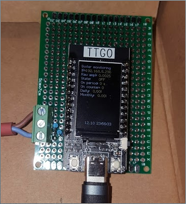
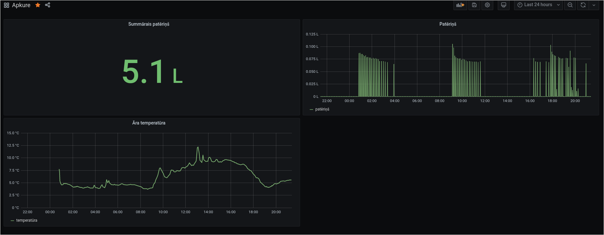

Diesel heating boiler monitor
-------------------------------------

This project is a scrappy attempt at non-intrusive monitoring of diesel-guzzling central heating boiler.

It uses a clamp-on current-transformer on the wire powering the main fuel pump of the boiler to integrate the time
pump is running and multiplies that by fuel nozzle's rated output (0.55 US gallons in my case). The output is sent
over serial port to python daemon which sends it to influxdb for plotting by grafana.

Hardware side
-------------

The Arduino IDE sketch is written for TTGO ESP32 dev board. Since the author did not
have a proper current transformer on hand, one was wound manually similar to [this](http://www.kerrywong.com/2011/07/16/simple-current-transformer/).

The current transformer had very noisy output when connected directly to ESP32's ADC,
but looking at signal plot, a strong 50Hz component was identified.

Since the magnitude of current measurement was not needed for this project, just the on/off state,
it was possible to detect if the pump is running based on FFT bin at 50Hz.

DS18B20 temperature sensor support was added to measure outside temperature, as it's quite an
influential variable I wanted to see.

The WiFi in this project is a bit under-utilized, as the RaspberryPi running influx/grafana was
quite close, so it's only used for time sync for resetting the daily/monthly counters.

When building the sketch, move config.h.sample to config.h and update with your own
wireless network information. Sorry, that is the quickest way to make sure I don't commit
my passwords.

Software side
------------------

Software side consists of python service which connects to the ESP32 over serial port and
writes consumption/status measurements to influxdb.

The end result is a nice plot that satisfies the inner wishes of data-nerd.

